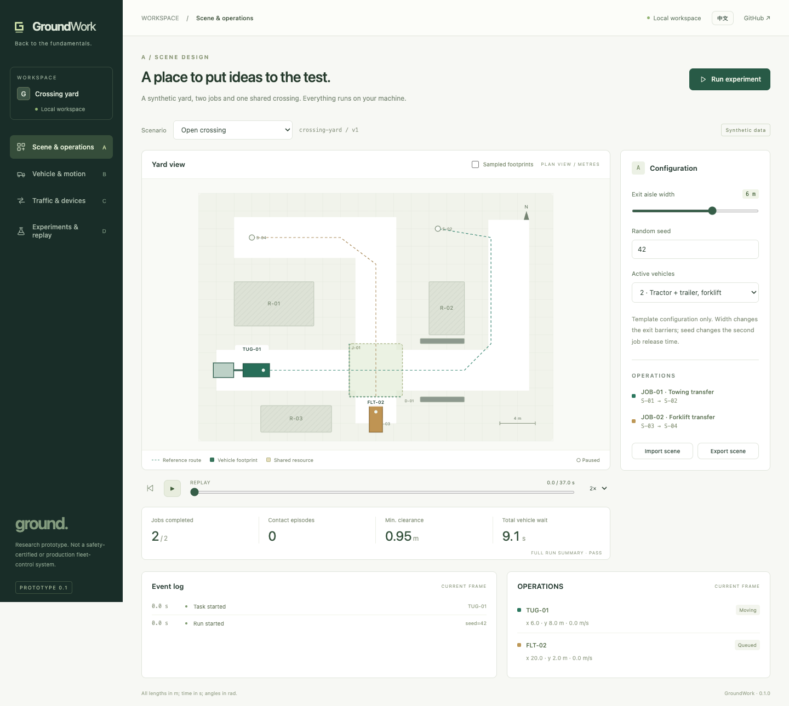

# GroundWork

**Back to the fundamentals.**

An open-source, local-first simulation and validation workbench for industrial vehicles. Built under the **Ground** brand, starting with towing tractors and forklifts in closed logistics yards.

[简体中文](README.zh-CN.md) · [Architecture](docs/architecture.md) · [Roadmap](docs/roadmap.md) · [Contributing](CONTRIBUTING.md)

> **v0.1 research prototype.** Runs synthetic, deterministic scenarios with simplified planar kinematics. Not production fleet control, a digital twin of a specific vehicle, or a safety certification tool. No customer data or hardware required.



## Run locally

Requires Node.js 20 or later and a modern browser. No third-party runtime dependencies, account, API key, build step or `npm install` required.

```sh
git clone https://github.com/cafechen/GroundWork.git
cd GroundWork
npm start
```

Open **http://127.0.0.1:4173**. The UI starts in Chinese; select **EN** at the top right for English. The server binds to loopback only. Stop it with `Ctrl+C`. Set `PORT=4174 npm start` if the default port is occupied (POSIX shells).

```sh
npm test
npm run check
```

Optional browser QA: with Playwright and its Chromium browser installed, start the app and run `node scripts/browser-smoke.mjs`. `PLAYWRIGHT_MODULE` and `CHROME_PATH` can point to existing installations. This checks all four modules, language switching, replay, imports, exports, batch runs and small-screen overflow. Screenshots are saved to the ignored `artifacts/` folder. Playwright is a QA-only dependency, not an application dependency.

## Four modules, one reproducible experiment

| Module | Implemented in v0.1 | Not implemented yet |
| --- | --- | --- |
| **A · Scene & operations** | Synthetic yard template, static racks/barriers, two routes and transfer jobs, adjustable exit width, seed, one/two vehicles, configuration JSON import/export | Freeform map editor, arbitrary map import, production task integrations |
| **B · Vehicle & motion** | Simple waypoint pursuit and bicycle kinematics; front-steered tractor with one on-axle hitch trailer; rear-steered forklift chassis; tractor/trailer/drawbar footprints; sampled polygon contacts and clearance | Calibrated vehicle dynamics, caster cart trains, payload/fork geometry and contact, reverse docking, continuous collision detection |
| **C · Traffic & devices** | Two vehicles, one FIFO crossing lock, whole-body resource release, virtual door opening delay, explicit waiting reasons, unsafe no-lock comparison | General MAPF, automatic deadlock diagnosis, PLC/door integrations, production braking/safety logic |
| **D · Experiments & replay** | Fixed-step seeded runs, play/pause/seek/speed, footprint samples, events, metrics, 12-run matched policy comparison, run JSON and standalone HTML report | Cloud orchestration, MCAP/ROS ingestion, historical run database, arbitrary baseline management |

All four screens use the **same simulation output**. Metrics are calculated, not hardcoded demonstration numbers. Editing a parameter recomputes the run and resets replay; summary metrics describe the whole run, while the map, task state and event log describe the selected frame.

## Try three demos

1. **Open crossing:** keep defaults, select *Run experiment*. Follow the tractor and its trailer through J-01; the forklift waits until the entire combination clears it. The default scenario completes without sampled contact.
2. **Tight turn · trailer contact:** choose this preset. In module B, enable *Sampled footprints*. Replay the turn or select a contact event in the log. The trailer cuts inside the tractor path and contacts a barrier.
3. **Delayed door · queue:** choose this preset and open module C. Inspect the door state, current owner and waiting reasons. Door delay increases waiting time.

Then open **D**, run the **12 paired trials** and inspect candidates. Each of six conditions (two seeds × three door timings) is run with FIFO and with no lock. The comparison changes only the policy within each pair. It intentionally illustrates regressions; it is not a benchmark against commercial planners.

## Model and metric contract

- Coordinates: metres, seconds, radians; +x east, +y north; counterclockwise heading. Fixed integration step defaults to 0.1 s; maximum horizon 90 s by default.
- Tractor state is referenced to its rear axle. The trailer hitch is at that axle; its parameter is **hitch-to-trailer axle distance**, not body length. Trailer body size is fixed at 2.3 × 1.65 m. This topology does **not** represent every industrial towing cart.
- The forklift uses a front-axle reference and reversed rear-steering sign. Only a simplified 3 × 1.5 m chassis is checked; forks, payload and lift are absent. Neither vehicle is calibrated to a manufacturer.
- Ideal localization, forward-only motion, flat ground, instantaneous speed changes and stopping. No tyre slip, acceleration limits, dynamics, perception or hardware control.
- Convex polygon SAT detects **sampled contact**, including touching. Discrete sampling can miss contact between steps. Footprint overlays are samples, **not** a continuous swept-volume computation.
- **Contact episodes** count each body-pair contact onset; they are not unique accident counts. Each body includes its own identifier, so trailer and drawbar contacts count separately.
- **Minimum clearance** is the minimum sampled polygon distance to obstacles and other vehicles; it is zero during penetration and does not include wall distance. Bounds violations are separately counted as contacts. No penetration depth is computed.
- **Total vehicle wait** sums door/resource waiting after each job is released; it is not wall-clock delay. The seed varies the forklift job release in the interval [4, 5) s.
- **Maximum reference-path error** is the greatest sampled axle-to-reference-polyline distance. It is reported, not an acceptance threshold.
- **PASS** means all jobs finish within the horizon and no sampled contacts occur. **FAIL** means contact or incomplete jobs. This is a narrow demonstration criterion, not proof of safety or acceptable industrial tracking accuracy.

See [architecture and data contracts](docs/architecture.md) before adapting the engine.

## Files and reproducibility

```text
src/
  app.js                 Browser workbench and replay
  i18n.js                English / Chinese copy
  styles.css             Responsive application UI
  core/
    scenario.js          A: validated template configuration and seeded RNG
    geometry.js          B: polygon geometry and distances
    simulation.js        B/C: motion, resources, events and frames
    experiments.js       D: paired experiments and report export
scripts/serve.mjs         Loopback-only static server
tests/core.test.js        Node built-in regression tests
docs/                    Architecture and roadmap (bilingual)
```

- **Scene JSON** imports/exports template configuration only. It is not an arbitrary geometry format. Only schema version 1 / `crossing-yard` is accepted.
- **Run JSON** includes engine version, full scenario/configuration, seed, time step, metrics, task results, frames and events. Run-bundle import is not yet supported.
- **HTML report** is a standalone, script-free result summary, event table and configuration; a computed batch is included when present.
- Runs live in memory until download; refresh loses unsaved runs. No telemetry, external fonts, CDN dependencies, upload or cloud service. The GitHub link navigates to an external website only when clicked.
- Re-run a saved configuration with the same engine version to reproduce it. The output is deterministic in the tested runtime; bit-identical floating-point results across all browsers/architectures are not promised.

## Direction

Start with a small, inspectable engineering loop:

**Scene → vehicle motion → operational interactions → reproducible evidence.**

The next useful work is validated vehicle topology, input contracts and independent reference tests—not a larger animated fleet. Chrono, ROS and MCAP are potential future adapters, not current integrations. We make no SEER, Multiway or coScene compatibility claim.

## Development principles: AI-native SDLC

GroundWork adopts Anthropic's [The AI-native SDLC playbook](https://claude.com/blog/the-ai-native-sdlc-playbook) as its overall development reference. We apply it to a solo-maintained, local-first engineering prototype, without requiring a particular AI vendor or paid service.

Our project rules are:

- Before changing simulation behavior, record the intended outcome, model assumptions, affected modules and acceptance cases; obtain the maintainer's agreement on unresolved modeling choices.
- Keep numerical logic in `src/core`, UI copy in both languages, and scenario evidence reproducible with explicit units, seed and engine version.
- A fix needs a demonstrated failing case and a passing regression. Never relax a clearance criterion or delete an assertion merely to obtain PASS.
- Review simulation correctness, local-data exposure and agreement with the requested scope separately. Report uncertainty; self-review is not independent validation.
- Require explicit authorization for remote writes and releases. Feed reproduced defects into future tests; do not add telemetry or background agents to this local-only prototype by default.

The operative instructions are in [AGENTS.md](AGENTS.md); the workflow, acceptance checklist and enforcement boundaries are in [development policy](docs/development-policy.md). The [2026-09-28 self-audit](docs/audits/2026-09-28-ai-native-sdlc.md) records **partial alignment**, not full adoption: local checks exist, but an approved artifact/commit chain, enforced review gates and agent-configuration evaluations are not yet established. Written policy does not itself enforce these controls.

## License

[MIT](LICENSE). Contributions are welcome; do not upload customer maps, robot logs, credentials or other data without permission.
