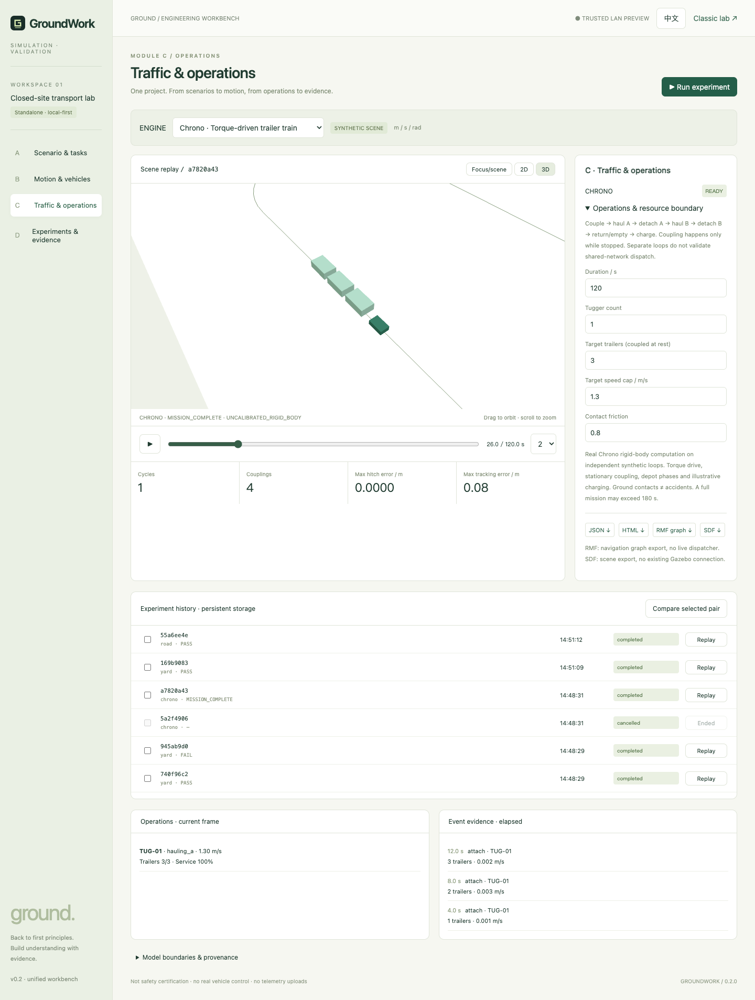

# GroundWork

**Back to the fundamentals.**

An open-source, local-first simulation and validation workbench for industrial vehicles. Built under the **Ground** brand, starting with towing tractors and forklifts in closed logistics yards.

[简体中文](README.zh-CN.md) · [Documentation](docs/README.md) · [First runnable example](docs/quickstart.md) · [Architecture](docs/architecture.md) · [Contributing](CONTRIBUTING.md)

> **Park-centric engineering preview.** Five menus: Overview, Maps, Device models, Gateways, Parks. Persistent resources and park-owned devices/tasks, editable business overlays, selected-map planar simulation and evidence. Legacy engines and the separate Chrono lab remain available. No Strategist/Robots runtime dependency; not production fleet control or safety certification.



## Run locally

Requires Node.js **22.19+** and a modern browser. Install and build the vendored workspace packages first. No account, hardware or model API key is required for template/structured-plan experiments.

```sh
git clone https://github.com/cafechen/GroundWork.git
cd GroundWork
npm ci
npm run build
npm start
```

Open **http://127.0.0.1:4173** for the park platform; `/workbench` retains the three-engine lab and `/classic` the v0.1 lab. The UI supports Chinese/English. Default binding is loopback; stop with `Ctrl+C`. LAN deployment requires an explicit `HOST` override and host allowlist; it has **no user authentication** and must not be exposed publicly. See [deployment](docs/deployment.md).

## Park platform

**Start with the [prechecked yard example](docs/quickstart.md)** to see a tugger
and trailer move, turn and slow down before authoring your own scene. It includes
a read-only preflight and an explicit API seeder. For route saving, initial-pose
errors and stationary `CONTACT` results, see [troubleshooting](docs/troubleshooting.md).

Create reusable maps/models/gateways, then a park with one or more of each.
Inside a park: Overview, Scene editor, Devices, Operations, Control panel,
Analytics, Settings. Resource versions, instances and scene edits persist in SQLite;
jobs/results retain their existing filesystem history.

Virtual tugger/forklift/AMR simulations use the selected map floor, explicit route,
walls, restricted/speed zones and supported model parameters. Status refreshes
automatically; completed runs replay frozen inputs. See the [product guide](docs/park-platform.md).

Physical devices/gateways are **registration only**: no real telemetry, video,
point-cloud ingestion or takeover. Quadrupeds are definition-only. Vendor/URDF
imports, sensor simulation and arbitrary-park Chrono dynamics are not connected.
The screenshot and A/B/C/D details below describe the retained legacy laboratory,
not the new navigation. Chrono stays in its separate synthetic mechanics lab.

```sh
npm test
npm run test:engines
npm run check
```

Optional browser QA: `BASE_URL=http://127.0.0.1:4173 node scripts/workbench-smoke.mjs`. `PLAYWRIGHT_MODULE` and `CHROME_PATH` can select existing Playwright/Chrome installations. The older `scripts/browser-smoke.mjs` covers `/classic`. Screenshots go to ignored `artifacts/`. Chrono and map conversion need separately installed Python dependencies; their availability is not implied by Node tests.

## Unified workbench: migrated capabilities

**Map library:** open `/maps` (or the workbench toolbar link) to inspect five
bundled Open-RMF worlds: Hotel, Office, Airport Terminal, Clinic and Campus.
Includes floor selection, 2D/3D geometry/topology, graph filters, facility markers
and source/JSON downloads. Manufacturing & Logistics is explicitly awaiting
source. The `/maps` viewer is static; parks can use selected-floor walls for a
**partial planar simulation**, not a complete digital twin. External Gazebo
meshes are not included, and Campus currently shows navigation topology only.
No ROS/Python service is needed to browse. See the [map manual](docs/map-library.md).

| Module | Available now | Boundary |
| --- | --- | --- |
| A | Copied schema contracts, movement catalog, editable structured plans, plan compilation/validation; local-metre road GeoJSON import; optional model gateway; standalone GeoJSON→AEQD/SDF/RMF converter | Default cases are synthetic. No private site data copied. Natural language is disabled until a real gateway is configured. |
| B | Existing tugger/forklift kinematics; copied road following/braking/lane-change engine; copied Chrono torque tractor and dynamic 0–3 trailer composition; local 2D/3D replay | These are different vehicle models, not interchangeable backends for one calibrated vehicle. No Chrono forklift/forklift lifting model. |
| C | Existing full-body FIFO/gate behavior; Chrono station phases, stationary attach/detach, following logic and illustrative charging | Synthetic Chrono demo uses separate loops. No live RMF dispatch, physical door, PLC or real robot connection. |
| D | Durable file-backed jobs, serial workers, progress/cancellation, restart recovery, run provenance, pair comparison, 12-run yard regression, JSON/HTML and map/trajectory exports | No accounts, cloud service, MCAP pipeline or production data management. XOSC is a trajectory catalog; downstream interoperability is unverified. |

The full copied behavior/template/search library is also available as `@groundwork/scenario-engine`; not every SDK capability has a dedicated GUI. See the [integration manual](docs/unified-workbench.md), [source provenance](docs/source-provenance.md), and [change record](docs/changes/unified-workbench/intent.md).

For a full Chrono service cycle, select **Chrono**, **1 vehicle**, **3 trailers**, **120 s**, then run and replay. `MISSION_COMPLETE` means the modeled operational cycle completed; `NOT_EVALUATED` means the horizon ended without that evidence. Neither means certified safe. Ground-inclusive contact totals are never labeled accident counts.

## Preserved classic lab

The following v0.1 table, demos and kinematic contracts apply specifically to **`/classic` and the `yard` engine**, not to Chrono or the road engine.

## Four modules, one reproducible experiment

| Module | Implemented in v0.1 | Not implemented yet |
| --- | --- | --- |
| **A · Scene & operations** | Synthetic yard template, static racks/barriers, two routes and transfer jobs, adjustable exit width, seed, one/two vehicles, configuration JSON import/export | Freeform map editor, arbitrary map import, production task integrations |
| **B · Vehicle & motion** | Simple waypoint pursuit and bicycle kinematics; front-steered tractor with one on-axle hitch trailer; rear-steered forklift chassis; tractor/trailer/drawbar footprints; sampled polygon contacts and clearance | Calibrated vehicle dynamics, caster cart trains, payload/fork geometry and contact, reverse docking, continuous collision detection |
| **C · Traffic & devices** | Two vehicles, one FIFO crossing lock, whole-body resource release, virtual door opening delay, explicit waiting reasons, unsafe no-lock comparison | General MAPF, automatic deadlock diagnosis, PLC/door integrations, production braking/safety logic |
| **D · Experiments & replay** | Fixed-step seeded runs, play/pause/seek/speed, footprint samples, events, metrics, 12-run matched policy comparison, run JSON and standalone HTML report | Cloud orchestration, MCAP/ROS ingestion, historical run database, arbitrary baseline management |

All four screens use the **same simulation output**. Metrics are calculated, not hardcoded demonstration numbers. Editing a parameter recomputes the run and resets replay; summary metrics describe the whole run, while the map, task state and event log describe the selected frame.

## Try three demos

1. **Open crossing:** keep defaults, select *Run experiment*. Follow the tractor and its trailer through J-01; the forklift waits until the entire combination clears it. The default scenario completes without sampled contact.
2. **Tight turn · trailer contact:** choose this preset. In module B, enable *Sampled footprints*. Replay the turn or select a contact event in the log. The trailer cuts inside the tractor path and contacts a barrier.
3. **Delayed door · queue:** choose this preset and open module C. Inspect the door state, current owner and waiting reasons. Door delay increases waiting time.

Then open **D**, run the **12 paired trials** and inspect candidates. Each of six conditions (two seeds × three door timings) is run with FIFO and with no lock. The comparison changes only the policy within each pair. It intentionally illustrates regressions; it is not a benchmark against commercial planners.

## Legacy `/classic` model and metric contract

- Coordinates: metres, seconds, radians; +x east, +y north; counterclockwise heading. Fixed integration step defaults to 0.1 s; maximum horizon 90 s by default.
- Tractor state is referenced to its rear axle. The trailer hitch is at that axle; its parameter is **hitch-to-trailer axle distance**, not body length. Trailer body size is fixed at 2.3 × 1.65 m. This topology does **not** represent every industrial towing cart.
- The forklift uses a front-axle reference and reversed rear-steering sign. Only a simplified 3 × 1.5 m chassis is checked; forks, payload and lift are absent. Neither vehicle is calibrated to a manufacturer.
- Ideal localization, forward-only motion, flat ground, instantaneous speed changes and stopping. No tyre slip, acceleration limits, dynamics, perception or hardware control.
- Convex polygon SAT detects **sampled contact**, including touching. Discrete sampling can miss contact between steps. Footprint overlays are samples, **not** a continuous swept-volume computation.
- **Contact episodes** count each body-pair contact onset; they are not unique accident counts. Each body includes its own identifier, so trailer and drawbar contacts count separately.
- **Minimum clearance** is the minimum sampled polygon distance to obstacles and other vehicles; it is zero during penetration and does not include wall distance. Bounds violations are separately counted as contacts. No penetration depth is computed.
- **Total vehicle wait** sums door/resource waiting after each job is released; it is not wall-clock delay. The seed varies the forklift job release in the interval [4, 5) s.
- **Maximum reference-path error** is the greatest sampled axle-to-reference-polyline distance. It is reported, not an acceptance threshold.
- **PASS** means all jobs finish within the horizon and no sampled contacts occur. **FAIL** means contact or incomplete jobs. This is a narrow demonstration criterion, not proof of safety or acceptable industrial tracking accuracy.

See [architecture and data contracts](docs/architecture.md) before adapting the engine.

## Files and reproducibility

```text
src/
  platform.js/css        Current five-menu park UI
  park-viewer.js         Selected-floor overlays and replay
  map-*.js               Static RMF data, library and renderer
  workbench.js/css        Legacy three-engine lab
  app.js, core/          Original lab and DOM-free geometry/kinematics
server/                  Resource schemas/SQLite, HTTP, workers, park simulation
packages/                Standalone copied contracts and scenario-engine SDK
engines/                 Optional Chrono and map-building Python tools
assets/maps/rmf/         Pinned original maps, licenses, normalized JSON
examples/ready-yard.mjs   Runnable synthetic yard fixture
scripts/                 Server, preflight/seeding and smoke checks
tests/                   Node regression suites
docs/                    Bilingual manuals, contracts and change evidence
```

- **Scene JSON** imports/exports template configuration only. It is not an arbitrary geometry format. Only schema version 1 / `crossing-yard` is accepted.
- **Run JSON** includes engine version, full scenario/configuration, seed, time step, metrics, task results, frames and events. Run-bundle import is not yet supported.
- **HTML report** is a standalone, script-free result summary, event table and configuration; a computed batch is included when present.
- In `/classic`, runs live in browser memory until download. Unified workbench jobs/results persist under `data/runs/` (or `GROUNDWORK_DATA`). No telemetry, external fonts or CDN. Explicit model-gateway use sends the entered prompt and movement catalog to the administrator-configured endpoint.
- Re-run a saved configuration with the same engine version to reproduce it. The output is deterministic in the tested runtime; bit-identical floating-point results across all browsers/architectures are not promised.

## Direction

Start with a small, inspectable engineering loop:

**Scene → vehicle motion → operational interactions → reproducible evidence.**

The next useful work is validated vehicle topology, richer yard scenarios and independent reference tests. Chrono is integrated; live ROS/RMF and MCAP remain future adapters. We make no SEER, Multiway or coScene compatibility claim.

## Development principles: AI-native SDLC

GroundWork adopts Anthropic's [The AI-native SDLC playbook](https://claude.com/blog/the-ai-native-sdlc-playbook) as its overall development reference. We apply it to a solo-maintained, local-first engineering prototype, without requiring a particular AI vendor or paid service.

Our project rules are:

- Before changing simulation behavior, record the intended outcome, model assumptions, affected modules and acceptance cases; obtain the maintainer's agreement on unresolved modeling choices.
- Keep numerical logic in DOM-free core/engine adapters (`src/core`, `packages/`, `engines/`, `server/park-simulation.mjs`), not in the UI; maintain both languages and explicit units, inputs and engine versions.
- A fix needs a demonstrated failing case and a passing regression. Never relax a clearance criterion or delete an assertion merely to obtain PASS.
- Review simulation correctness, local-data exposure and agreement with the requested scope separately. Report uncertainty; self-review is not independent validation.
- Require explicit authorization for remote writes and releases. Feed reproduced defects into future tests; do not add telemetry or background agents to this local-only prototype by default.

The operative instructions are in [AGENTS.md](AGENTS.md); the workflow and enforcement
boundaries are in [development policy](docs/development-policy.md). The
[current code/documentation audit](docs/audits/2026-09-28-park-sdlc.md) concludes
**partial alignment**, not full adoption: tested code and committed records exist,
but staged approval commits, enforced review gates, agent evaluations and a fully
closed user-defect loop do not. The [initial audit](docs/audits/2026-09-28-ai-native-sdlc.md)
is historical. Written policy is not an enforced control or independent certification.

## License

[MIT](LICENSE) for original GroundWork code; see [third-party notices](THIRD_PARTY_NOTICES.md) and [source provenance](docs/source-provenance.md) for migrated code/dependencies and publication review. Do not upload customer maps, robot logs, credentials or other data without permission.
