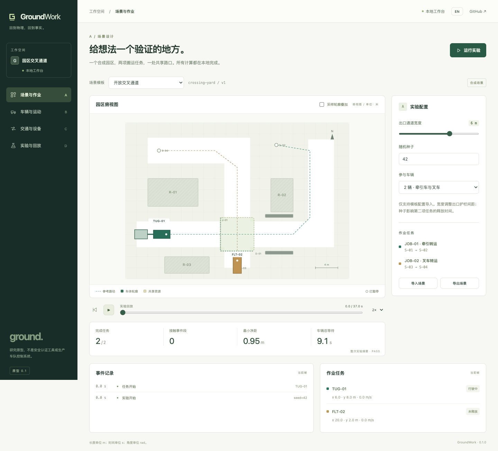

# GroundWork

**回到物理，回到事实。**

Ground 品牌下，面向工业车辆的开源、本地优先仿真与验证工作台。从封闭园区的牵引车与叉车切入，让场景、车辆、作业交互与实验记录形成一个可复现的验证流程。

[English](README.md) · [架构说明](docs/architecture.md) · [路线图](docs/roadmap.md) · [参与贡献](CONTRIBUTING.md)

> **v0.1 研究原型。** 使用合成场景、确定性实验和简化平面运动学。不是生产调度系统，不是某款真车的数字孪生，也不构成安全认证。不需要客户数据或硬件。



## 本地启动

需要 Node.js 20 或更高版本及现代浏览器。没有第三方运行时依赖，不需要账号、API Key、构建步骤，也不需要执行 `npm install`。

```sh
git clone https://github.com/cafechen/GroundWork.git
cd GroundWork
npm start
```

打开 **http://127.0.0.1:4173**。界面默认中文，右上角 **EN** 可切换英文。服务仅监听本机地址，`Ctrl+C` 停止。如端口被占用，可在 POSIX 终端执行 `PORT=4174 npm start`。

```sh
npm test
npm run check
```

可选浏览器验收：已安装 Playwright 及其 Chromium 时，启动应用后执行 `node scripts/browser-smoke.mjs`；也可用 `PLAYWRIGHT_MODULE`、`CHROME_PATH` 指向现有安装。脚本检查四模块、语言切换、回放、导入导出、批量实验与小屏溢出，截图写入已忽略的 `artifacts/`。Playwright 仅供验收，应用运行不需要它。

## A / B / C / D 四个模块

| 模块 | v0.1 已实现 | 暂未实现 |
| --- | --- | --- |
| **A · 场景与作业** | 合成园区模板、货架与护栏、两条路径与搬运任务、出口通道宽度、种子、单车/双车、模板配置 JSON 导入导出 | 自由绘图、任意地图导入、真实业务任务系统 |
| **B · 车辆与运动** | 简单目标点追踪与单轨运动学；前轮转向牵引车 + 单节轴上铰接拖车；后轮转向叉车车身；车体/拖车/连接杆轮廓；离散多边形接触与净距 | 标定动力学、万向轮拖车列、货叉与载荷几何/接触、倒车对接、连续碰撞检测 |
| **C · 交通与设备** | 两车、一处先到先服务互斥资源、完整组合驶离后释放、虚拟门延迟、明确等待原因、无互斥的不安全对照 | 通用多车路径规划、自动死锁诊断、真实 PLC/门禁、生产制动与安全逻辑 |
| **D · 实验与回放** | 固定步长与种子、播放/暂停/定位/倍速、轮廓采样叠加、事件与指标、12 次配对实验、实验 JSON、独立 HTML 报告 | 云批量调度、MCAP/ROS 接入、历史实验数据库、任意版本基线管理 |

四个页面使用**同一份仿真结果**，不是四组互不相干的静态演示。参数变化会重新计算并重置回放；指标卡描述整次实验，地图、任务状态和事件列表对应当前帧。

## 先体验三个案例

1. **开放交叉通道：** 保持默认配置，点击「运行实验」。观察牵引车与拖车经过 J-01，叉车等待整个组合驶离后再进入。默认案例可完成任务且未检测到离散接触。
2. **窄通道转弯 · 拖车擦碰：** 选择模板，在 B 模块勾选「采样轮廓叠加」。回放转弯，或点击已经发生的接触事件定位。拖车向弯内侧偏移，与护栏发生接触。
3. **门延迟开启 · 排队等待：** 选择模板并进入 C 模块。查看门状态、占用者和等待原因，观察门延迟带来的等待增加。

然后进入 **D**，运行 **12 次配对实验**：两种种子 × 三种门开启时刻，共六组条件，每组分别运行互斥基线和无互斥候选。组内只改变策略，用于演示可复现退化，不是商业调度算法排行榜。

## 模型与指标边界

- 世界坐标单位为米、秒、弧度；x 向东、y 向北，航向逆时针为正。默认积分步长 0.1 秒，最长仿真 90 秒。
- 牵引车以后轴为参考点，拖车铰接点也位于该轴。可调的是**铰接点至拖车轴距**，不是拖车车身长度。拖车固定车身为 2.3 × 1.65 米。该拓扑**不能代表所有工业料车**。
- 叉车以前轴为参考点，后轮转向符号反转。仅检查简化的 3 × 1.5 米车身，不含货叉、载荷、举升；两类车均未按厂商实车标定。
- 理想定位、平地、仅前进、瞬时变速与停车；不模拟轮胎侧滑、加减速限制、动力学、感知或硬件控制。
- 使用凸多边形 SAT 进行**离散采样接触检测**，刚好接触也计入。可能漏掉帧间接触。轮廓叠加不是严格连续扫掠体计算。
- **接触事件段：** 按每对几何体从不接触到接触的起点计数，不等于事故次数。拖车与连接杆分别接触会分别计数。
- **最小净距：** 车体与障碍物、其他车辆之间的最小采样多边形距离；穿透时为零，不计算穿透深度，也不计边界距离。越过园区边界单独计为接触事件。
- **车辆总等待：** 任务释放后因门或资源而等待的累计车辆秒数，不是墙钟耗时。种子使叉车任务在 [4, 5) 秒内释放。
- **最大参考路径偏差：** 参考轴到路径折线的最大采样距离。当前仅报告，不作为验收阈值。
- **PASS：** 全部任务在时限内完成，且没有离散接触；**FAIL：** 发生接触或任务未全部完成。该判定不证明安全，也不证明跟踪精度满足工业要求。

改造引擎前请阅读[架构与数据契约](docs/architecture.md)。

## 项目结构与复现

```text
src/
  app.js                 浏览器工作台与回放
  i18n.js                中英文案
  styles.css             响应式界面
  core/
    scenario.js          A：模板配置校验、固定种子随机数
    geometry.js          B：多边形几何与距离
    simulation.js        B/C：运动、资源、事件、帧
    experiments.js       D：配对实验与报告
scripts/serve.mjs         仅监听本机的静态服务
tests/core.test.js        Node 内置测试
docs/                    双语架构与路线图
```

- **场景 JSON：** 仅导入导出模板配置，不是任意地图格式。只接受 `schemaVersion: 1`、`crossing-yard`。
- **实验 JSON：** 包含引擎版本、完整场景/配置、种子、步长、指标、任务结果、帧与事件；暂不支持实验包导入。
- **HTML 报告：** 独立、无脚本的结果摘要、事件表和配置；已计算批次会随报告一起导出。
- 实验只保存在内存，刷新会丢失未下载的结果。没有遥测、外部字体、CDN 依赖、上传和云服务。GitHub 链接只在点击时访问外站。
- 同版本引擎与相同配置可重新运行复现；测试运行时内结果确定，不承诺所有浏览器/硬件的浮点结果逐位相同。

## 项目方向

**场景 → 车辆运动 → 作业交互 → 可复现证据。**

下一步优先做经验证的车辆拓扑、输入契约和独立参考测试，不以动画车辆数量作为能力证明。Chrono、ROS、MCAP 是候选后续适配方向，目前尚未集成；不声明兼容仙工、劢微或 coScene。

## 开发原则：AI-native SDLC

GroundWork 采用 Anthropic 的 [The AI-native SDLC playbook](https://claude.com/blog/the-ai-native-sdlc-playbook) 作为整体开发参考，并按个人维护、本地优先工程原型的实际情况落地，不绑定特定 AI 厂商或付费服务。

本项目的具体规则：

- 改变仿真行为前，记录目标、模型假设、受影响模块和验收案例；未明确的建模选择须由维护者确认。
- 数值逻辑保留在 `src/core`，用户文案保持中英一致，复现证据包含单位、种子与引擎版本。
- 修复必须有可证明的失败案例及通过的回归；不得为了得到 PASS 放宽净距标准或删除断言。
- 分别检查仿真正确性、本地数据暴露和是否符合请求范围；明确不确定性，自检不冒充独立验证。
- 远端写入和发布需要明确授权；复现的缺陷进入后续测试，不默认为本地原型接入遥测或后台代理。

代理执行规则见 [AGENTS.md](AGENTS.md)，完整流程、验收清单和执行边界见[开发政策](docs/development-policy.md)。[2026-09-28 自检](docs/audits/2026-09-28-ai-native-sdlc.md)的结论是**部分符合，而非全面落地**：已有本地检查，但经确认的产物/提交链、强制审查门禁、代理配置评估尚未建立。书面政策本身不能强制执行这些控制。

## 许可证

[MIT](LICENSE)。欢迎提交最小可复现案例，但请勿上传未经授权的客户地图、机器人日志、凭证或其他数据。
