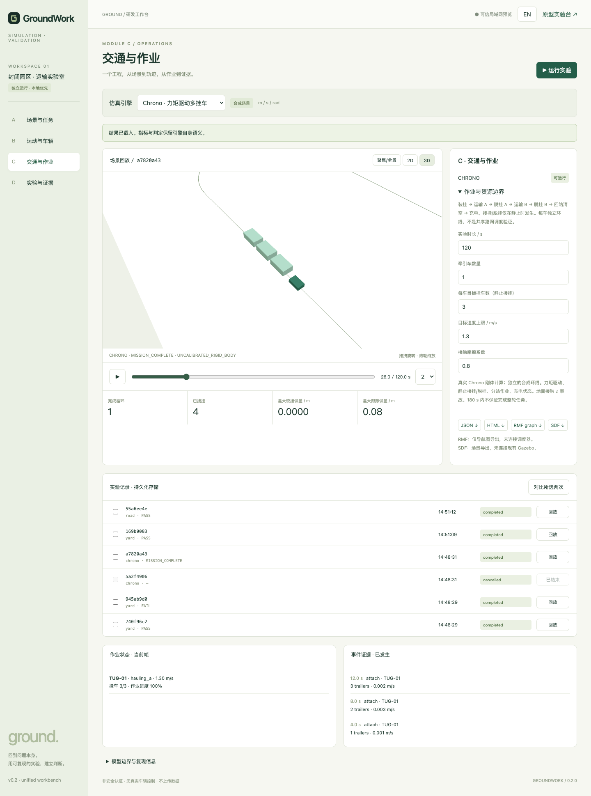

# GroundWork

**回到物理，回到事实。**

Ground 品牌下，面向工业车辆的开源、本地优先仿真与验证工作台。从封闭园区的牵引车与叉车切入，让场景、车辆、作业交互与实验记录形成一个可复现的验证流程。

[English](README.md) · [架构说明](docs/architecture.md) · [路线图](docs/roadmap.md) · [参与贡献](CONTRIBUTING.md)

> **园区研发平台预览。** 五个主菜单：总览、地图管理、设备模型管理、接入网关、园区管理。资源持久化，设备和作业归属于园区，支持业务图层编辑、选定地图上的平面仿真与证据分析。旧引擎和独立 Chrono 实验室保留。运行时不依赖 Strategist/Robots；不是生产调度或安全认证工具。



## 本地启动

需要 **Node.js 22.19+** 和现代浏览器。先安装依赖并构建已平移的 workspace 包。模板与结构化方案实验不需要账号、硬件或模型 API Key。

```sh
git clone https://github.com/cafechen/GroundWork.git
cd GroundWork
npm ci
npm run build
npm start
```

打开 **http://127.0.0.1:4173** 进入园区平台；`/workbench` 保留三引擎实验室，`/classic` 保留 v0.1 实验台。支持中英切换，默认仅监听本机，`Ctrl+C` 停止。局域网部署需显式设置 `HOST` 和主机白名单；当前**没有用户认证，不能暴露公网**。见[部署说明](docs/deployment.md)。

## 园区平台

准备地图、设备模型和网关，再创建园区，关联一个或多个上述资源。园区内菜单：
园区概览、场景编辑、设备实例、作业管理、控制面板、统计分析、园区配置。
资源版本、实例和业务图层保存在 SQLite；作业和结果沿用文件持久化机制。

虚拟牵引车、叉车和轮式机器人使用选定地图楼层、显式路线、墙体、禁行区、限速区
和已支持的模型参数计算。状态自动刷新，完成后回放冻结输入。参见[产品说明](docs/park-platform.md)。

实机和外部网关目前**仅登记配置**，尚无真实遥测、视频、点云或接管。机器狗仅定义；
厂商/URDF 模型、传感器仿真、任意园区上的 Chrono 力学尚未接通。下方截图和 A/B/C/D
说明属于保留的旧实验室，不是新的主菜单。Chrono 仍使用明确标注的独立合成场景。

```sh
npm test
npm run test:engines
npm run check
```

可选浏览器验收：执行 `BASE_URL=http://127.0.0.1:4173 node scripts/workbench-smoke.mjs`；`PLAYWRIGHT_MODULE`、`CHROME_PATH` 可指定已有 Playwright/Chrome。旧脚本 `scripts/browser-smoke.mjs` 验证 `/classic`。截图保存在忽略的 `artifacts/`。Chrono 和地图转换需要单独的 Python 依赖，Node 测试通过不代表它们已安装。

## 统一工作台：本次迁移能力

**地图资源库**：打开 `/maps`，或点击工作台引擎栏的地图入口，查看酒店、办公室、
机场航站楼、诊所、校园五张 Open-RMF 地图。支持楼层切换、2D/3D、导航图筛选、设施
标记和 JSON/原始文件下载；制造与物流明确标记待取得源码。`/maps` 是静态查看器；
园区已可使用选定楼层墙体进行**局部平面仿真**，不代表完整数字孪生。外部 Gazebo
网格未包含，Campus 当前仅显示导航拓扑。浏览无需
ROS/Python 服务。详见[地图手册](docs/map-library.md)。

| 模块 | 已接通 | 边界 |
| --- | --- | --- |
| A | 平移契约、movement 目录、可编辑结构化方案、编译校验；本地米制道路 GeoJSON 导入；可选模型网关；独立 GeoJSON→AEQD/SDF/RMF 转换工具 | 默认合成场景，未复制私有园区数据。未配置真实模型网关时禁用自然语言生成。 |
| B | 原牵引车/叉车运动学；平移道路跟车/制动/换道引擎；平移 Chrono 力矩牵引车与动态 0–3 挂车；本地 2D/3D 回放 | 三类模型不能冒充同一辆标定车辆。尚无 Chrono 叉车及举升模型。 |
| C | 原全车体 FIFO/门控；Chrono 分站作业、静止接挂/脱挂、跟车逻辑与充电状态 | Chrono 演示使用独立环线；未接真实 RMF 调度、物理门、PLC 或机器人。 |
| D | 文件持久化队列、串行独立进程、进度/取消、重启恢复、输入溯源、两次实验对比、园区 12 次配对回归、JSON/HTML 与地图/轨迹导出 | 无账号、云服务、MCAP 数据管线；XOSC 是轨迹目录，未验证下游兼容性。 |

完整平移的行为/模板/搜索库也可通过 `@groundwork/scenario-engine` 调用；并非每个 SDK 能力都有专门 GUI。详见[集成手册](docs/unified-workbench.md)、[源码来源](docs/source-provenance.md)、[变更记录](docs/changes/unified-workbench/intent.md)。

建议先选 **Chrono → 1 辆车 → 3 节挂车 → 120 秒**，运行后回放完整作业循环。`MISSION_COMPLETE` 只表示模型中的作业循环完成；`NOT_EVALUATED` 表示时长内尚无完成证据。两者都不是安全认证，包含地面接触的计数不作为事故数。

## 保留的经典实验台

下面的 v0.1 表格、案例与运动学约定，仅适用于 **`/classic` 和 `yard` 引擎**，不适用于 Chrono 或道路行为引擎。

## A / B / C / D 四个模块

| 模块 | v0.1 已实现 | 暂未实现 |
| --- | --- | --- |
| **A · 场景与作业** | 合成园区模板、货架与护栏、两条路径与搬运任务、出口通道宽度、种子、单车/双车、模板配置 JSON 导入导出 | 自由绘图、任意地图导入、真实业务任务系统 |
| **B · 车辆与运动** | 简单目标点追踪与单轨运动学；前轮转向牵引车 + 单节轴上铰接拖车；后轮转向叉车车身；车体/拖车/连接杆轮廓；离散多边形接触与净距 | 标定动力学、万向轮拖车列、货叉与载荷几何/接触、倒车对接、连续碰撞检测 |
| **C · 交通与设备** | 两车、一处先到先服务互斥资源、完整组合驶离后释放、虚拟门延迟、明确等待原因、无互斥的不安全对照 | 通用多车路径规划、自动死锁诊断、真实 PLC/门禁、生产制动与安全逻辑 |
| **D · 实验与回放** | 固定步长与种子、播放/暂停/定位/倍速、轮廓采样叠加、事件与指标、12 次配对实验、实验 JSON、独立 HTML 报告 | 云批量调度、MCAP/ROS 接入、历史实验数据库、任意版本基线管理 |

四个页面使用**同一份仿真结果**，不是四组互不相干的静态演示。参数变化会重新计算并重置回放；指标卡描述整次实验，地图、任务状态和事件列表对应当前帧。

## 先体验三个案例

1. **开放交叉通道：** 保持默认配置，点击「运行实验」。观察牵引车与拖车经过 J-01，叉车等待整个组合驶离后再进入。默认案例可完成任务且未检测到离散接触。
2. **窄通道转弯 · 拖车擦碰：** 选择模板，在 B 模块勾选「采样轮廓叠加」。回放转弯，或点击已经发生的接触事件定位。拖车向弯内侧偏移，与护栏发生接触。
3. **门延迟开启 · 排队等待：** 选择模板并进入 C 模块。查看门状态、占用者和等待原因，观察门延迟带来的等待增加。

然后进入 **D**，运行 **12 次配对实验**：两种种子 × 三种门开启时刻，共六组条件，每组分别运行互斥基线和无互斥候选。组内只改变策略，用于演示可复现退化，不是商业调度算法排行榜。

## 模型与指标边界

- 世界坐标单位为米、秒、弧度；x 向东、y 向北，航向逆时针为正。默认积分步长 0.1 秒，最长仿真 90 秒。
- 牵引车以后轴为参考点，拖车铰接点也位于该轴。可调的是**铰接点至拖车轴距**，不是拖车车身长度。拖车固定车身为 2.3 × 1.65 米。该拓扑**不能代表所有工业料车**。
- 叉车以前轴为参考点，后轮转向符号反转。仅检查简化的 3 × 1.5 米车身，不含货叉、载荷、举升；两类车均未按厂商实车标定。
- 理想定位、平地、仅前进、瞬时变速与停车；不模拟轮胎侧滑、加减速限制、动力学、感知或硬件控制。
- 使用凸多边形 SAT 进行**离散采样接触检测**，刚好接触也计入。可能漏掉帧间接触。轮廓叠加不是严格连续扫掠体计算。
- **接触事件段：** 按每对几何体从不接触到接触的起点计数，不等于事故次数。拖车与连接杆分别接触会分别计数。
- **最小净距：** 车体与障碍物、其他车辆之间的最小采样多边形距离；穿透时为零，不计算穿透深度，也不计边界距离。越过园区边界单独计为接触事件。
- **车辆总等待：** 任务释放后因门或资源而等待的累计车辆秒数，不是墙钟耗时。种子使叉车任务在 [4, 5) 秒内释放。
- **最大参考路径偏差：** 参考轴到路径折线的最大采样距离。当前仅报告，不作为验收阈值。
- **PASS：** 全部任务在时限内完成，且没有离散接触；**FAIL：** 发生接触或任务未全部完成。该判定不证明安全，也不证明跟踪精度满足工业要求。

改造引擎前请阅读[架构与数据契约](docs/architecture.md)。

## 项目结构与复现

```text
src/
  app.js                 浏览器工作台与回放
  i18n.js                中英文案
  styles.css             响应式界面
  core/
    scenario.js          A：模板配置校验、固定种子随机数
    geometry.js          B：多边形几何与距离
    simulation.js        B/C：运动、资源、事件、帧
    experiments.js       D：配对实验与报告
scripts/serve.mjs         独立 HTTP/API 入口（默认监听本机）
tests/core.test.js        Node 内置测试
docs/                    双语架构与路线图
```

- **场景 JSON：** 仅导入导出模板配置，不是任意地图格式。只接受 `schemaVersion: 1`、`crossing-yard`。
- **实验 JSON：** 包含引擎版本、完整场景/配置、种子、步长、指标、任务结果、帧与事件；暂不支持实验包导入。
- **HTML 报告：** 独立、无脚本的结果摘要、事件表和配置；已计算批次会随报告一起导出。
- `/classic` 的实验只在浏览器内存中保存；统一工作台的任务/结果持久化到 `data/runs/`（或 `GROUNDWORK_DATA`）。无遥测、外部字体和 CDN。显式使用模型网关时，会向管理员配置的端点发送输入描述和 movement 目录。
- 同版本引擎与相同配置可重新运行复现；测试运行时内结果确定，不承诺所有浏览器/硬件的浮点结果逐位相同。

## 项目方向

**场景 → 车辆运动 → 作业交互 → 可复现证据。**

下一步优先做经验证的车辆拓扑、更丰富的园区场景和独立参考测试。Chrono 已集成，实时 ROS/RMF 与 MCAP 尚未接通；不声明兼容仙工、劢微或 coScene。

## 开发原则：AI-native SDLC

GroundWork 采用 Anthropic 的 [The AI-native SDLC playbook](https://claude.com/blog/the-ai-native-sdlc-playbook) 作为整体开发参考，并按个人维护、本地优先工程原型的实际情况落地，不绑定特定 AI 厂商或付费服务。

本项目的具体规则：

- 改变仿真行为前，记录目标、模型假设、受影响模块和验收案例；未明确的建模选择须由维护者确认。
- 数值逻辑保留在无 DOM 的核心和引擎适配器（`src/core`、`packages/`、`engines/`、`server/park-simulation.mjs`），不混入界面；用户文案保持中英一致，复现证据包含单位、输入与引擎版本。
- 修复必须有可证明的失败案例及通过的回归；不得为了得到 PASS 放宽净距标准或删除断言。
- 分别检查仿真正确性、本地数据暴露和是否符合请求范围；明确不确定性，自检不冒充独立验证。
- 远端写入和发布需要明确授权；复现的缺陷进入后续测试，不默认为本地原型接入遥测或后台代理。

代理执行规则见 [AGENTS.md](AGENTS.md)，完整流程、验收清单和执行边界见[开发政策](docs/development-policy.md)。[2026-09-28 自检](docs/audits/2026-09-28-ai-native-sdlc.md)的结论是**部分符合，而非全面落地**：已有本地检查，但经确认的产物/提交链、强制审查门禁、代理配置评估尚未建立。书面政策本身不能强制执行这些控制。

## 许可证

原创 GroundWork 代码采用 [MIT](LICENSE)；迁移代码、依赖及对外发布审查见[第三方说明](THIRD_PARTY_NOTICES.md)和[源码来源](docs/source-provenance.md)。请勿上传未经授权的客户地图、机器人日志、凭证或其他数据。
